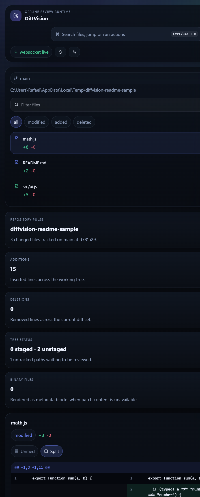
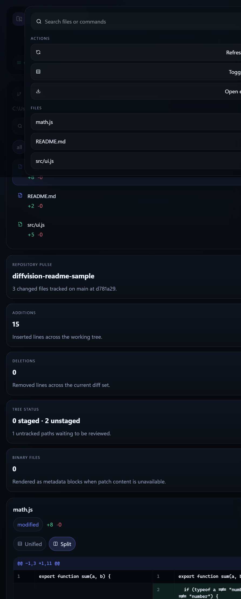
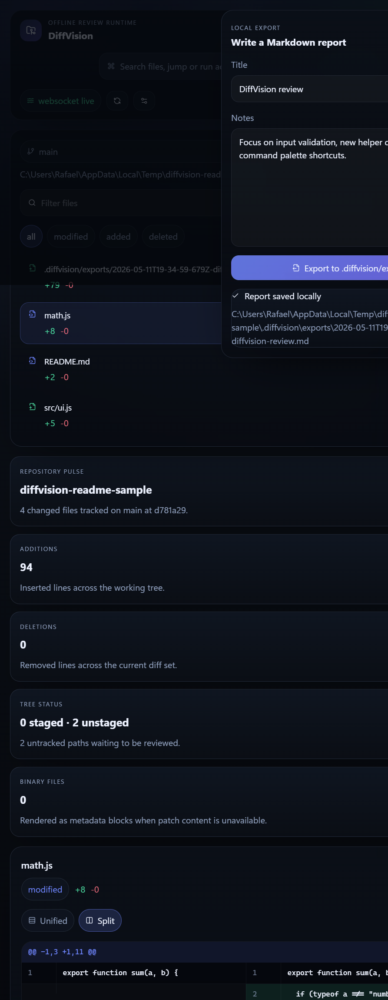

# DiffVision

DiffVision is a local-first Git diff review tool shipped as an npm CLI. It opens your current working tree in a focused browser UI so you can inspect changed files, switch diff modes, search quickly, track review iterations, and export a Markdown review without sending code to a remote service.

<p>
	
</p>

## Why use it

- Review your local Git changes in a dedicated UI instead of a crowded terminal diff.
- Inspect modified, added, deleted, renamed, untracked, and binary files from one place.
- Switch between built-in dark and light themes without leaving the review workspace.
- Switch between split and unified diff layouts while reviewing.
- Add inline review comments with category and severity metadata.
- Keep a local review history so each export becomes `v1`, `v2`, `v3`, and so on.
- Jump through files and actions with a command palette.
- Export the current draft, selected previous reviews, or the complete review history.
- Keep the session live while the working tree changes.

## Install

DiffVision requires Node.js 20+ and Git available on your PATH.

```bash
npm install -g diffvision
```

You can also run it without a global install:

```bash
npx diffvision
pnpm dlx diffvision
bunx diffvision
```

The package also ships `diffvision-mcp`, a local MCP stdio server for AI agents.

## Changelog

Versioned release notes live in [CHANGELOG.md](./CHANGELOG.md). The published npm package now includes both the README and changelog so users can inspect release history from the installed tarball.

## Quick start

Run DiffVision inside any Git repository:

```bash
diffvision
```

DiffVision will:

1. Detect the nearest Git repository.
2. Load the current working tree diff against `HEAD` by default.
3. Start a local Fastify server.
4. Open the embedded web UI in your browser unless disabled.

If you want to inspect another repository or compare against a different base ref:

```bash
diffvision --cwd /path/to/repository
diffvision --compare main
diffvision --new-in origin/develop --relative-to main
```

## What the UI gives you

- Repository overview with branch, changed file count, additions, deletions, and tree status.
- Persistent theme picker with editor-inspired dark and light palettes that keep chrome, overlays, and syntax highlighting in sync.
- Editable comparison base so you can switch from `HEAD` to `main`, `origin/main`, a tag, or a commit.
- Optional ref-to-ref mode that shows what is new in one ref relative to another.
- File list with quick filtering and per-file change counts.
- Split and unified diff modes for the active file.
- Inline comments per line with category (`bug`, `security`, `performance`, etc.) and severity (`info` to `critical`).
- Review history panel so you can inspect `v1`, `v2`, `v3`, or a combined `General` timeline.
- One-click copy of the raw patch for the active file.
- Command palette for fast navigation and common actions.
- Local export flow for the current review, selected previous reviews, or the full review history.
- Live repository refresh through a local WebSocket channel.

### Command palette

<p>
	
</p>

Use `Ctrl/Cmd + K` to search files or trigger built-in actions (refresh, toggle diff mode, open export).

### Local export

<p>
	
</p>

Use `Ctrl/Cmd + E` to open the export panel and write a Markdown review into `.diffvision/exports`, copy minified review JSON, or re-export previous iterations. Exporting the current draft archives it as the next review version and opens a fresh empty draft automatically.

## Keyboard shortcuts

| Shortcut       | Action                      |
| -------------- | --------------------------- |
| `Ctrl/Cmd + K` | Open command palette        |
| `Ctrl/Cmd + E` | Open export panel           |
| `Ctrl/Cmd + R` | Refresh repository snapshot |
| `Esc`          | Close palette/export panel  |

## CLI options

| Option                | Description                                                |
| --------------------- | ---------------------------------------------------------- |
| `--host <host>`       | Host to bind the local server.                             |
| `--port <port>`       | Preferred port for the local server.                       |
| `--compare <ref>`     | Legacy alias for `--base <ref>`.                           |
| `--new-in <ref>`      | Show what is new in this ref.                              |
| `--relative-to <ref>` | Compare the `--new-in` ref relative to this ref.           |
| `--base <ref>`        | Legacy alias for `--new-in <ref>`.                         |
| `--target <ref>`      | Legacy alias for `--relative-to <ref>`.                    |
| `--open`              | Force browser launch.                                      |
| `--no-open`           | Disable automatic browser launch.                          |
| `--cwd <path>`        | Inspect a repository different from the current directory. |
| `--ui-origin <url>`   | Development-only UI origin override.                       |
| `--logs <mode>`       | Enable terminal logging. Use `all` for full internal logs. |
| `--version`           | Print the installed DiffVision version and exit.           |
| `--help`              | Show CLI help.                                             |

Examples:

```bash
diffvision main
diffvision --host 127.0.0.1 --port 3210
diffvision --compare origin/main
diffvision --new-in origin/develop --relative-to main
diffvision --no-open
diffvision --cwd /path/to/repository
diffvision --version
diffvision --logs all
```

`diffvision main` is shorthand for “show everything new in the current branch relative to `main`”. Internally it behaves like `diffvision --relative-to main`, keeping `HEAD` as the ref being reviewed.

## MCP stdio server

`diffvision-mcp` exposes the active DiffVision review session over MCP stdio so an AI client can inspect the current diff and write inline comments straight into the active review draft stored in `.diffvision/comments.json`.

```bash
diffvision-mcp --cwd /path/to/repository
```

### Configure `mcp.json` for this project

If you want to use DiffVision MCP from VS Code, install the published package first:

```bash
npm install -g diffvision
```

Then create `.vscode/mcp.json` and point the server command at the published bin:

```json
{
  "servers": {
    "diffvision": {
      "type": "stdio",
      "command": "diffvision-mcp",
      "args": ["--cwd", "${workspaceFolder}"]
    }
  }
}
```

This is the recommended setup for VS Code MCP with the published package: install `diffvision` once, then invoke the `diffvision-mcp` bin directly from `mcp.json`.

You do not need to hardcode `--relative-to main` in `mcp.json`. If you want the AI to choose the review context on each MCP call, leave comparison flags out of the startup config and pass them in the tool input.

Example tool inputs when the AI wants to choose a specific diff view for that call:

```json
{
  "newIn": "HEAD",
  "relativeTo": "main"
}
```

```json
{
  "filePath": "src/ui/App.tsx",
  "newIn": "feature/review-pass",
  "relativeTo": "develop"
}
```

`get_repo_overview`, `read_diff`, and `create_review_comment` now accept these optional `newIn` and `relativeTo` fields. If omitted, DiffVision MCP falls back to the startup flags or the saved `.diffvision/config.json` values.

Notes:

- Use workspace configuration when you want the MCP server to run against this repository and share the setup with the team.
- If you want one fixed comparison for every MCP session, you can still add startup flags like `--relative-to main` or `--new-in origin/develop` to `mcp.json`.
- `--cwd ${workspaceFolder}` ensures the MCP server reads `.diffvision/config.json` and `.diffvision/comments.json` from the current repository.
- Add `--author <name>` to the `args` list if you want a custom author label on comments created by the AI.
- Per-call `relativeTo: ""` clears a default base ref for that one tool call and falls back to a direct review of `newIn` versus `HEAD`.
- `--logs all` is optional for debugging and is safe because DiffVision MCP writes logs to `stderr`, not MCP `stdout`.
- After saving `mcp.json`, restart the server from VS Code with `MCP: List Servers` if it does not restart automatically.

Available MCP tools:

- `get_repo_overview` for repository metadata, changed files, and active review status.
- `read_diff` for the raw patch of a changed file plus any existing comments already stored for that file.
- `list_review_comments` for the current review history, optionally filtered by file or review id.
- `create_review_comment` to append a new inline comment into the active DiffVision draft.

Useful flags:

- `--author <name>` changes the author label written into MCP-created comments.
- `--compare <ref>`, `--new-in <ref>`, and `--relative-to <ref>` mirror the main DiffVision comparison flags.
- `--logs all` sends internal logs to `stderr` so the MCP `stdout` channel stays protocol-safe.

## Local-only by default

DiffVision is designed for offline-first review workflows.

- Your repository stays on your machine.
- Review reports are written into the repository under `.diffvision`.
- No account, cloud sync, or external review service is required.

## Files written by DiffVision

DiffVision stores optional configuration and generated exports inside the target repository:

```txt
<repo-root>/.diffvision/config.json
<repo-root>/.diffvision/comments.json
<repo-root>/.diffvision/exports/*.md
```

Example configuration:

```json
{
  "theme": "dark",
  "openBrowser": true,
  "defaultView": "side-by-side",
  "port": 3210,
  "host": "127.0.0.1",
  "compareRef": "HEAD",
  "compareTargetRef": "main"
}
```

## Typical workflow

1. Start DiffVision in a repository you are actively editing.
2. Review the changed file list and inspect the highest-risk patches first.
3. Switch between split and unified views depending on the change shape.
4. Export the current review when ready; DiffVision archives it as `v1`, `v2`, `v3`, and opens the next draft automatically.

## Development

```bash
pnpm install
pnpm dev
pnpm build
pnpm lint
pnpm test
pnpm release
```

## Release checklist

```bash
pnpm build
pnpm test
npm publish
```

Before publishing, update `README.md`, append the new entry to `CHANGELOG.md`, and bump the version in `package.json`.
